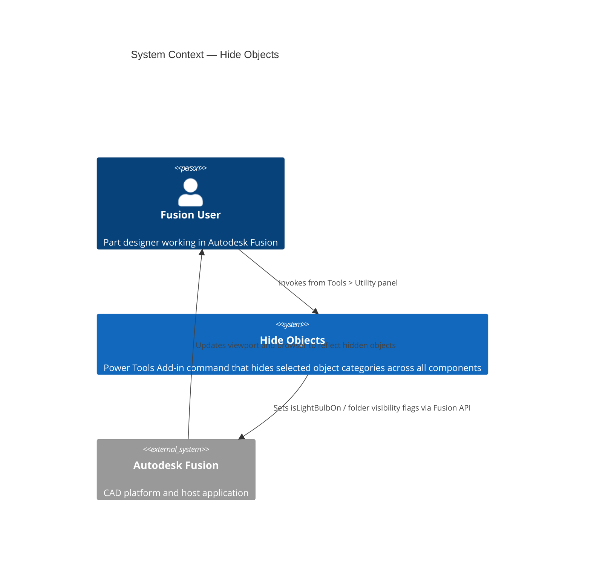
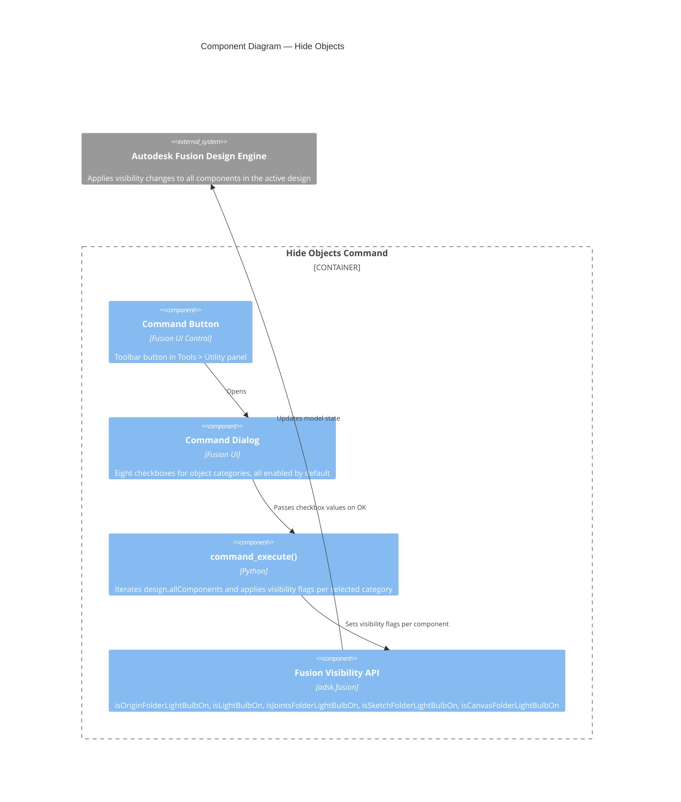

# Hide Objects

[Back to README](../README.md)

## Overview

The **Hide Objects** command hides selected categories of reference and construction geometry across every component in the active design in a single operation. Use this command to quickly declutter the viewport before sharing, rendering, or reviewing a model.

> **Note:** The command hides objects by turning off their visibility light bulbs. It does not delete or suppress any geometry. Objects can be made visible again from the browser at any time.

## Prerequisites

- A design document must be open in Autodesk Fusion.
- The active workspace must be the Design workspace.

## Access

The **Hide Objects** command is available in Fusion's **Tools** tab, in the **Utility** panel.

1. Open a design document in Autodesk Fusion.
2. Select the **Tools** tab in the toolbar.
3. Open the **Utility** panel.
4. Select **Hide Objects**.

## How to use

1. Run **Hide Objects** from the **Utility** panel.
2. In the dialog, select the object categories you want to hide:

   | Option | What it hides |
   | --- | --- |
   | **Origin** | The origin folder (axes and planes) for every component |
   | **Construction Points** | All construction points in every component |
   | **Construction Axes** | All construction axes in every component |
   | **Construction Planes** | All construction planes in every component |
   | **Joint Origins** | All joint origins in every component |
   | **Joints** | The joints folder for every component |
   | **Sketches** | All sketches in every component (sketch folder remains visible in browser) |
   | **Canvas** | The canvas folder for every component |

3. All checkboxes are enabled by default. Uncheck any category you want to leave visible.
4. Click **OK** to apply.

## Expected results

- Visibility is turned off for each selected category across **all components** in the design, including nested components.
- The sketch folder itself remains visible in the browser even when individual sketches are hidden, matching Fusion's standard construction geometry behavior.
- No geometry is deleted or suppressed. All changes are reversible from the browser.

## Limitations

- The command hides objects in all components simultaneously. There is no per-component or per-object selection.
- The command does not provide a corresponding **Show Objects** operation. Use the browser to restore visibility as needed.
- Canvas visibility is controlled at the folder level. Individual canvases cannot be targeted independently.

---

## Architecture

### System context

The following diagram shows the relationship between the user, the Hide Objects command, and Autodesk Fusion.

### Component diagram

The following diagram shows how the internal components of the command interact during execution.

