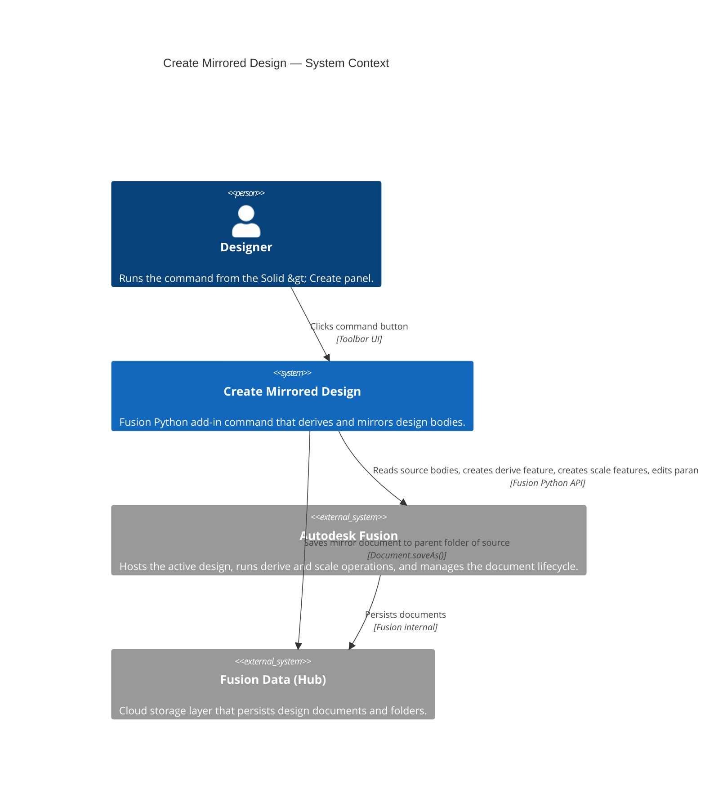
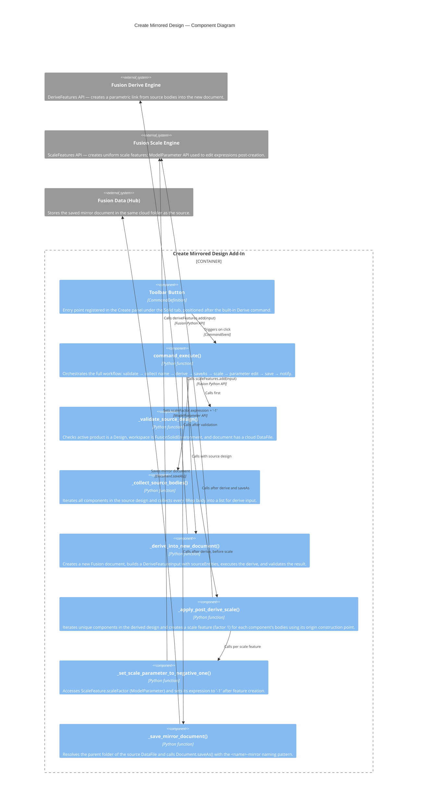

# Create Mirrored Design

[Back to README](../README.md)

## Overview

**Create Mirrored Design** derives all solid bodies from the active saved design into a brand-new document, saves the new document as `<active-name>-mirror` in the same Fusion data folder, and applies a uniform scale of `-1` to all derived bodies — producing a geometrically mirrored copy of the part without modifying the source ( this trick to use scale with a factor of -1 is known as the "Lockwood Manuever")

> **Note:** The source design must be saved to Fusion before running this command. Unsaved designs cannot be Mirrored.

## Prerequisites

- An Autodesk Fusion design is open and active.
- The design has been saved to Fusion (it has a cloud data file).
- The active workspace is the **Design** workspace (`FusionSolidEnvironment`).

## Access

**Create Mirrored Design** is located in the Design workspace under **Solid &rsaquo; Create**, immediately after the built-in Derive command.

1. Open a saved 3D design in Autodesk Fusion.
2. Switch to the **Design** workspace if not already active.
3. Click the **Solid** tab in the toolbar.
4. Expand the **Create** panel.
5. Click **Create Mirrored Design** (listed after **Derive**).

## How to use

1. Open the 3D design you want to mirror and make it the active document.
2. Confirm the design has been saved to Fusion (a cloud icon with no unsaved indicator).
3. Navigate to **Solid &rsaquo; Create** and click **Create Mirrored Design**.
4. The command validates the active design, collects all solid bodies, and derives them into a new Fusion design document.
5. The new document is saved automatically as `<source-name>-mirror` in the same Fusion data folder as the source.
6. A scale feature (factor `1`) is created for each component's bodies using the component origin as the reference point.
7. Each scale feature's parameter expression is immediately edited to `-1` via the ModelParameter API.
8. The mirror document is saved a second time to commit the scale changes.
9. A confirmation message displays the name of the mirrored design.

## Expected results

- A new document named `<source-name>-mirror` appears in the same Fusion project folder as the source design.
- All solid bodies in the mirrored design are flipped — equivalent to a mirror through the world origin — via a parametric scale `-1` feature.
- The source design is not modified.
- The parametric scale features in the mirror document remain editable in the timeline.

## Limitations

- The source design **must be saved** to Fusion. Local/unsaved designs are rejected with an error message.
- If a document named `<source-name>-mirror` already exists in the same folder, the Save As operation will fail. Rename or delete the existing document first.
- Only **BRep solid bodies** are derived. Mesh bodies, sketch geometry, and construction geometry are not included in the derive operation.
- The command must be run from the **Design workspace**. It is not available in Drawing, Simulation, or Manufacturing workspaces.
- Multi-body components are each scaled independently using their own origin construction point.

---

## Architecture

### System context

### Component diagram

---

[Back to README](../README.md)

*Copyright © 2026 IMA LLC. All rights reserved.*
