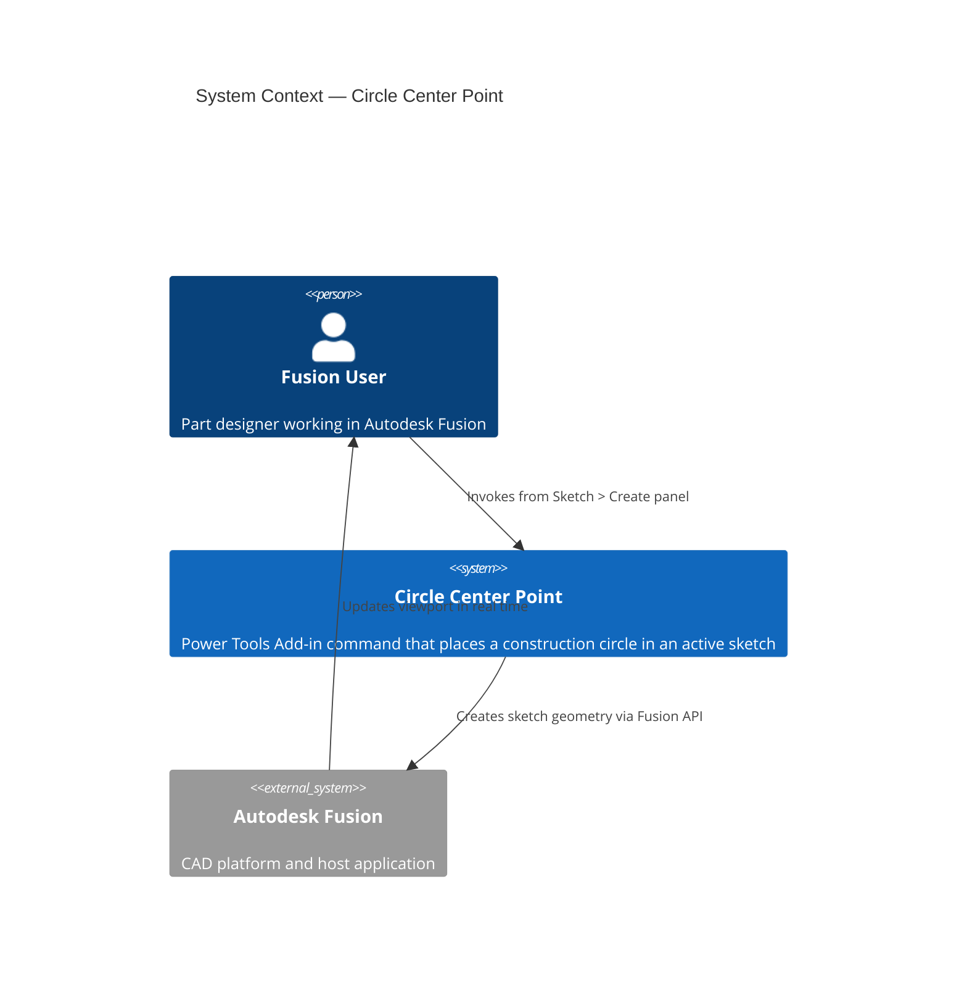
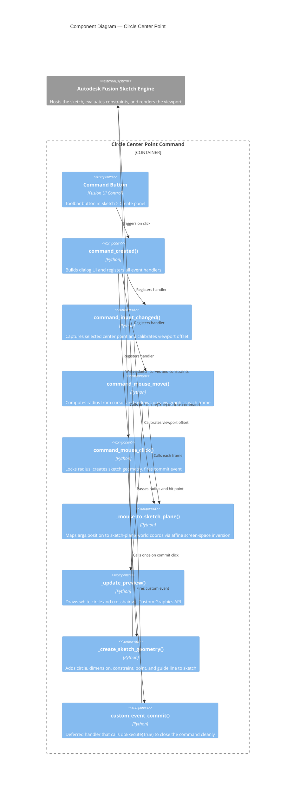

# Circle Center Point

[Back to README](../README.md)

## Overview

The **Circle Center Point** command places a construction circle in the active sketch by selecting an existing sketch point as the center, then dragging the mouse to the desired radius and clicking to commit. A diameter dimension and a vertically constrained sketch point are automatically added at the top of the circle.

Use this command when you need a reference circle anchored to an existing sketch point with its diameter locked by a driven dimension.

## Prerequisites

- A design document must be open in Autodesk Fusion.
- A sketch must be in active edit mode.
- At least one sketch point or vertex must exist in the sketch to use as the circle center.

## Access

The **Circle Center Point** command is available in Fusion's **Sketch** tab, in the **Create** panel.

1. Open a design document in Autodesk Fusion.
2. Double-click a sketch in the browser or on the canvas to enter sketch edit mode.
3. On the **Sketch** tab, select the **Create** panel.
4. Select **Circle Center Point** from the panel.

## How to use

1. Enter sketch edit mode by double-clicking the sketch you want to work in.
2. Run **Circle Center Point** from the **Create** panel.
3. Click a sketch point or vertex in the viewport to set the circle center.
4. Move the mouse — a white preview circle and crosshair track the cursor in real time, showing the current diameter.
5. Click again to commit the circle at the current diameter.

The command closes automatically after the circle is created.

### Alternatively

You can type a specific diameter value into the **Diameter** field in the dialog, then press **Create** (or **Enter**) instead of clicking in the viewport.

## What is created

Each time the command runs, five sketch objects are added to the active sketch:

| Object | Type | Notes |
| --- | --- | --- |
| Circle | Construction curve | Centered on the selected point |
| Diameter dimension | Sketch dimension | Driven by the drag or typed value |
| Coincident constraint | Geometric constraint | Locks the circle center to the selected point |
| Sketch point | Sketch point | Placed on the circle directly above the center |
| Vertical guide line | Construction line | Connects center to the top sketch point; vertical constraint applied |

## Preview graphics

While dragging, two temporary graphics appear in the viewport:

- **White circle** — outline of the circle at the current radius
- **White crosshair** — marks the exact cursor position on the sketch plane

Both graphics are removed when the command closes.

## Limitations

- The command requires an existing sketch point or vertex as the center. It cannot place a free circle at an arbitrary location.
- Only one circle can be created per command invocation. Run the command again to place additional circles.
- The preview is not visible if the sketch is viewed edge-on (the cursor is parallel to the sketch plane).

---

## Architecture

### System context

### Component diagram

### Coordinate space note

Fusion's `MouseEventArgs.position` reports cursor coordinates in **application-window space**, while `Viewport.modelToViewSpace()` returns coordinates in **viewport-local space**. The two share the same pixel scale but differ by a constant offset equal to the viewport's top-left corner within the application window.

The command calibrates this offset once at the moment the center point is selected (when both the click position and the projected center screen position are known simultaneously), then applies the correction on every `mouseMove` event so that the affine screen-space inversion produces accurate sketch-plane coordinates.

---

[Back to README](../README.md)

*Copyright © 2026 IMA LLC. All rights reserved.*
