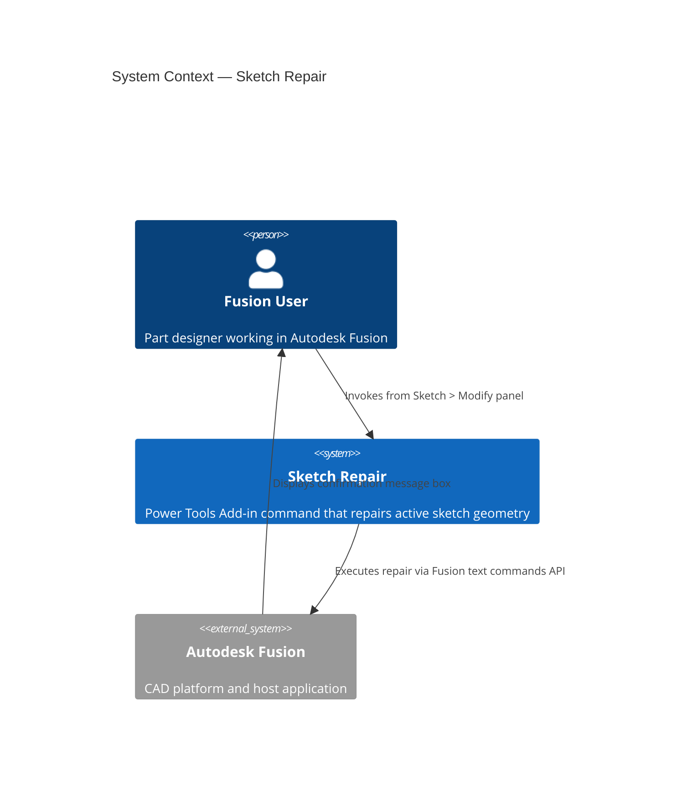
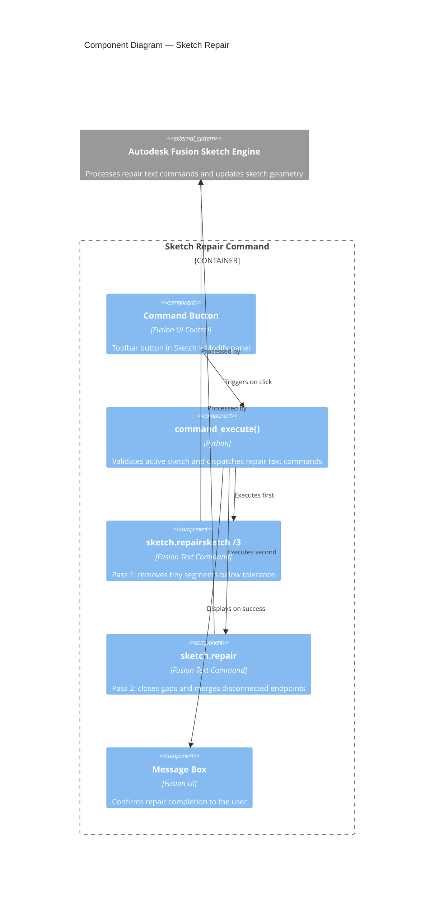

# Sketch Repair

[Back to README](../README.md)

## Overview

The **Sketch Repair** command attempts to automatically fix common issues in the active Autodesk Fusion sketch, including tiny gaps between endpoints and disconnected curve segments. Use this command when a sketch fails to form the closed profiles that solid body operations such as Extrude or Revolve require.

> **Note:** Results vary depending on the number and type of issues present in the sketch. The command cannot repair large gaps or fundamentally disconnected geometry.

## Prerequisites

- A design document must be open in Autodesk Fusion.
- A sketch must be in active edit mode.

## Access

The **Sketch Repair** command is available in Fusion's **Sketch** tab, in the **Modify** panel, at the bottom of the panel menu.

1. Open a design document in Autodesk Fusion.
2. Double-click a sketch in the browser or on the canvas to enter sketch edit mode.
3. On the **Sketch** tab, select the **Modify** panel.
4. Select **Sketch Repair** from the panel menu.

## How to use

1. Enter sketch edit mode by double-clicking the sketch you want to repair.
2. Run **Sketch Repair** from the **Modify** panel.
3. The command applies two sequential repair passes to the active sketch:
   - **Pass 1:** Removes tiny segments at or below the geometry tolerance threshold.
   - **Pass 2:** Merges disconnected endpoints and closes small gaps.
4. A confirmation message box appears when the repair is complete.
5. Inspect the sketch to verify the repair results. If open profiles remain, manual correction may be needed.

## Expected results

- Tiny segments at or below the geometry tolerance threshold are removed.
- Endpoints within tolerance are snapped together, closing small gaps.
- A message box confirms that the repair completed successfully.

## Limitations

- The command cannot repair large gaps or fundamentally disconnected geometry.
- Complex sketches with many issues may require multiple repair passes or manual correction.
- Repair quality depends on sketch geometry tolerance settings configured in Autodesk Fusion.

---

## Architecture

### System context

The following diagram shows the relationship between the user, the Sketch Repair command, and Autodesk Fusion.

### Component diagram

The following diagram shows how the internal components of the command interact during execution.

---

[Back to README](../README.md)

IMA LLC Copyright
