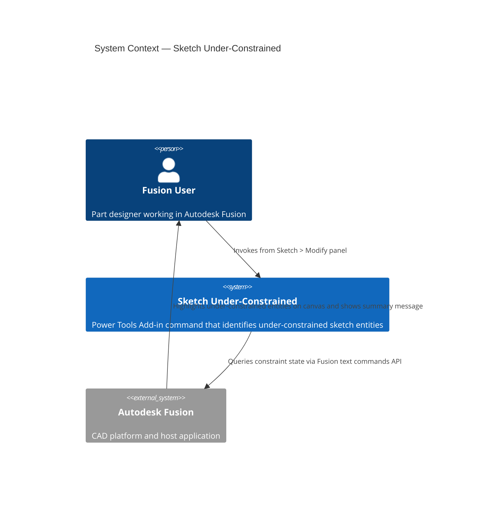
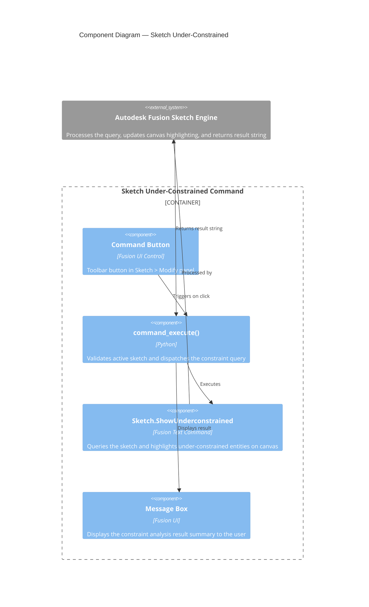

# Sketch Under-Constrained

[Back to README](../README.md)

## Overview

The **Sketch Under-Constrained** command highlights all sketch entities in the active sketch that lack sufficient constraints or dimensions. Use this command to quickly identify which lines, curves, or points still need constraints applied, especially in complex sketches with many entities.

A fully constrained sketch is generally required before using sketch profiles to create solid features such as Extrude or Revolve.

> **Note:** This command is read-only. It highlights under-constrained entities but does not automatically apply constraints.

## Prerequisites

- A design document must be open in Autodesk Fusion.
- A sketch must be in active edit mode.

## Access

The **Sketch Under-Constrained** command is available in Fusion's **Sketch** tab, in the **Modify** panel, at the bottom of the panel menu.

1. Open a design document in Autodesk Fusion.
2. Double-click a sketch in the browser or on the canvas to enter sketch edit mode.
3. On the **Sketch** tab, select the **Modify** panel.
4. Select **Sketch Under-Constrained** from the panel menu.

## How to use

1. Enter sketch edit mode by double-clicking the sketch you want to analyze.
2. Run **Sketch Under-Constrained** from the **Modify** panel.
3. The command queries the active sketch for entities that are not fully constrained.
4. Under-constrained entities are highlighted directly on the canvas.
5. A message box displays a summary of the analysis results.
6. Apply dimensions, geometric constraints, or fix points to the highlighted entities as needed.
7. Re-run the command after making changes to verify that all entities are now fully constrained.

## Expected results

- Under-constrained sketch entities are visually highlighted in the Fusion canvas.
- A message box displays a summary of the under-constrained entity status.

## Limitations

- The command does not apply constraints automatically. All constraint changes must be made manually.
- The command must be re-run after applying constraints to see updated results.
- Fixed geometry and driven dimensions are not flagged as under-constrained.

---

## Architecture

### System context

The following diagram shows the relationship between the user, the Sketch Under-Constrained command, and Autodesk Fusion.

### Component diagram

The following diagram shows how the internal components of the command interact during execution.

---

[Back to README](../README.md)

*Copyright © 2026 IMA LLC. All rights reserved.*
