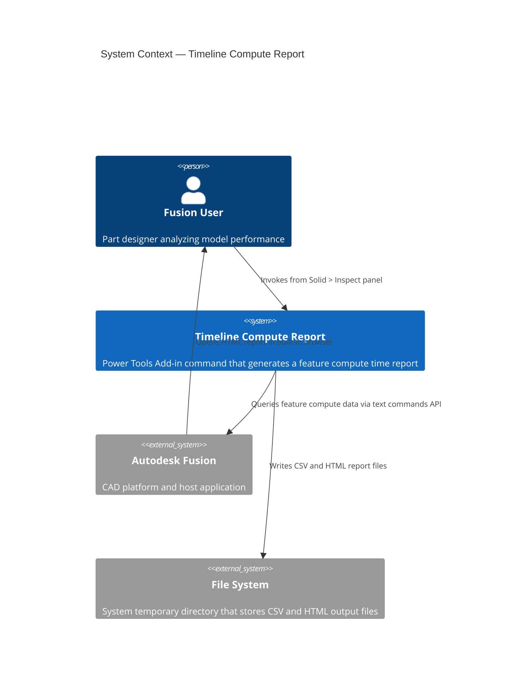
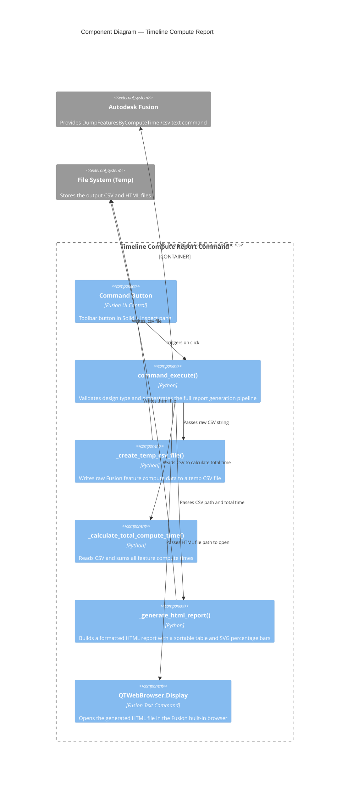

# Timeline Compute Report

[Back to README](../README.md)

## Overview

The **Timeline Compute Report** command generates an interactive HTML report that displays the compute time for every feature in the active design's model timeline. Features are sorted from shortest to longest compute time, making it straightforward to identify which features contribute the most to model rebuild duration.

The command also exports the underlying data as a CSV file to your system's temporary directory for further analysis.

> **Note:** This command is available only for parametric (timeline-based) designs. It is not available for designs in Direct Design mode.

## Prerequisites

- A design document must be open in Autodesk Fusion.
- The design must use the parametric timeline. Designs in Direct Design mode are not supported.

## Access

The **Timeline Compute Report** command is available in Fusion's **Solid** tab, in the **Inspect** panel.

1. Open a parametric design document in Autodesk Fusion.
2. On the **Solid** tab, select the **Inspect** panel.
3. Select **Timeline Compute Report**.

## How to use

1. Open the parametric design you want to analyze.
2. Run **Timeline Compute Report** from the **Inspect** panel on the **Solid** tab.
3. Fusion generates a CSV data file containing the compute time for each timeline feature and saves it to your system's temp directory.
4. The add-in processes the CSV data and builds a formatted HTML report.
5. The report automatically opens in Fusion's built-in browser.
6. Review the table columns to identify features with unexpectedly high compute times or percentages.

## Understanding the report

The report header shows the **total timeline compute time** in `h:mm:ss.mmm` format (hours, minutes, seconds, milliseconds).

The report table includes the following columns:

| Column | Description |
|---|---|
| **Component** | The component that owns the timeline feature. |
| **Feature** | The name of the timeline feature. |
| **Time (seconds)** | The feature's individual compute time, in seconds. |
| **Percent** | The feature's compute time as a percentage of total timeline compute time, displayed as a visual progress bar. |
| **Health** | The feature's current health state (for example, **OK**, **Warning**, or **Error**). |

Features are sorted from shortest to longest compute time. Features at the bottom of the list with disproportionately high percentage values are the most likely candidates for optimization.

## Output files

The command writes two files to the system's temporary directory:

| File | Format | Description |
|---|---|---|
| `<random-id>.csv` | CSV | Raw feature data exported from Fusion, used as the report source. |
| `<random-id>.html` | HTML | Formatted compute time report displayed in the Fusion built-in browser. |

Both files use random identifiers. The temporary directory is `%TEMP%` on Windows and `/tmp` on macOS.

## Limitations

- Not available for designs in Direct Design mode.
- Compute times reflect the state at the last full timeline regeneration. For the most accurate results, allow Fusion to fully regenerate the model before running the report.
- The report is a static snapshot. It does not update automatically when the model changes.

---

## Architecture

### System context

The following diagram shows the relationship between the user, the Timeline Compute Report command, Autodesk Fusion, and the file system.

### Component diagram

The following diagram shows how the internal components of the command interact during execution.

---

[Back to README](../README.md)

IMA LLC Copyright
